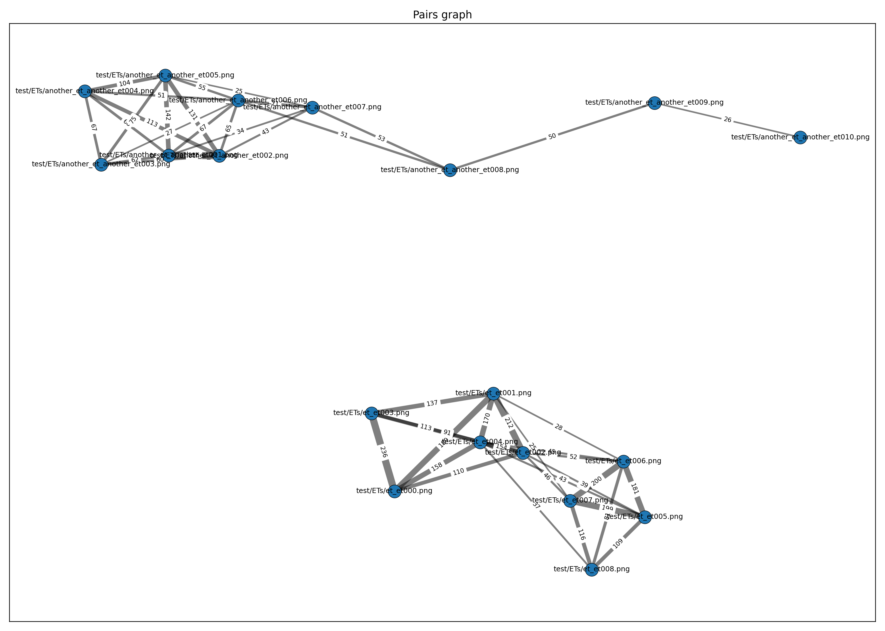

Feature Matching → Geometric Verification → (Optional) SfM with COLMAP
Conduct 3D Reconstructions on classified images in a folder with similar context but different scenarios (eg ET plush in front of a plastic shelf vs another design of ET in front of wooden shelf)
This repo implements a two-stage image matching pipeline:

1) Global retrieval with DINOv2
2) Local matching with SuperPoint + LightGlue, followed by geometric verification (RANSAC)
3) 3D reconstruction via pycolmap/COLMAP

It’s designed for fast candidate generation (global) and precise correspondence estimation (local), and can export to a COLMAP database for SfM.

